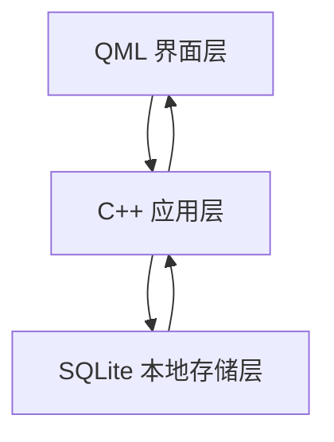
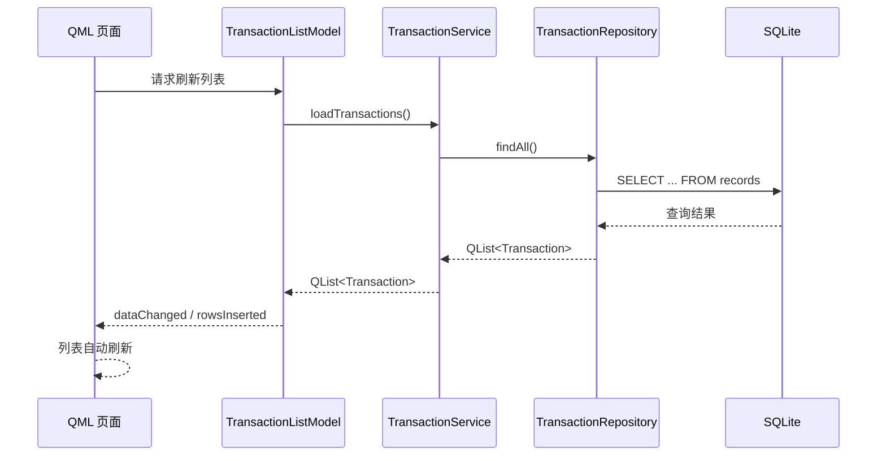

# 个人记账 App 架构说明

本文档说明个人记账 App 第一版的架构分层、数据流和目录结构。第一版技术栈固定为 Qt 6 + QML + C++ + SQLite + CMake，目标是先完成桌面版本地记账 MVP。

## 1. 总体架构

第一版采用三层结构：



核心原则：

- QML 只负责界面展示和轻量交互。
- C++ 负责数据模型、数据库访问、业务逻辑和统计计算。
- SQLite 负责本地持久化存储。
- QML 不直接访问 SQLite。
- QML 不直接实现记账业务规则。

## 2. QML 层职责

QML 层是用户界面层，负责把 C++ 提供的数据展示出来，并把用户操作传递给 C++。

QML 负责：

- 页面布局，例如首页、添加记录页、历史记录页、编辑记录页。
- UI 控件，例如按钮、输入框、下拉选择、列表、确认弹窗。
- 展示 C++ 模型中的 Transaction 数据。
- 展示本月收入、本月支出、本月结余等统计结果。
- 收集用户输入，例如金额、分类、日期、备注。
- 调用 C++ 暴露的方法，例如添加、编辑、删除记录。
- 处理简单界面状态，例如当前选中的页面、弹窗是否显示。

QML 不负责：

- 不拼接 SQL。
- 不执行数据库查询。
- 不创建或管理 SQLite 连接。
- 不计算本月统计结果。
- 不校验复杂业务规则。
- 不保存复杂应用状态。

## 3. C++ 层职责

C++ 层是应用核心层，负责把界面操作转换成可靠的数据读写和业务结果。

C++ 负责：

- 定义 Transaction 数据结构。
- 定义暴露给 QML 的数据模型，例如 `TransactionListModel`。
- 封装 SQLite 初始化、建表、迁移、查询和写入。
- 实现添加收入、添加支出、编辑记录、删除记录等业务方法。
- 校验输入数据，例如金额必须大于 0，类型只能是 `income` 或 `expense`。
- 计算统计数据，例如本月收入、本月支出、本月结余。
- 处理错误并向 QML 返回可展示的结果。
- 通过 `QObject`、`QAbstractListModel`、`Q_INVOKABLE`、属性和信号向 QML 暴露能力。

建议第一版把 C++ 层拆成几类：

- `DatabaseManager`：管理 SQLite 连接、初始化和迁移。
- `TransactionRepository`：负责 Transaction 的增删改查 SQL。
- `TransactionListModel`：把 Transaction 列表暴露给 QML。
- `TransactionService`：封装添加、编辑、删除等业务流程。
- `StatisticsService`：封装本月收入、支出、结余计算。

## 4. SQLite 层职责

SQLite 层是本地存储层，只负责保存和查询数据，不承载界面逻辑。

SQLite 负责：

- 保存记账记录。
- 根据 C++ 查询条件返回记录。
- 支持 C++ 统计查询。
- 保证本地数据在 App 关闭后仍然存在。

第一版核心表建议为 `records`：

| 字段 | 类型 | 说明 |
| --- | --- | --- |
| `id` | INTEGER | 主键，自增 |
| `type` | TEXT | 记录类型：`income` 或 `expense` |
| `amount` | INTEGER | 金额，单位为分 |
| `category` | TEXT | 分类名称 |
| `date` | TEXT | 记账日期，格式为 `YYYY-MM-DD` |
| `note` | TEXT | 备注，可为空 |
| `created_at` | TEXT | 创建时间 |
| `updated_at` | TEXT | 更新时间 |

SQLite 不负责：

- 不决定页面如何展示。
- 不处理按钮点击。
- 不直接暴露给 QML。
- 不实现跨设备同步。
- 不保存登录或云端账号信息。

## 5. Transaction 数据如何从 SQLite 传到 QML

本文档中的 Transaction 指一条记账记录，不是数据库事务。

推荐数据流如下：



第一版推荐流程：

1. SQLite 中的 `records` 表保存原始数据。
2. `TransactionRepository` 执行 SQL 查询，把每一行转换成 C++ `Transaction` 对象。
3. `TransactionService` 调用 Repository，并处理业务过滤、排序或错误。
4. `TransactionListModel` 持有 `QList<Transaction>`。
5. `TransactionListModel` 继承 `QAbstractListModel`，通过角色把字段暴露给 QML。
6. QML 使用 `ListView`、`Repeater` 等控件绑定 `TransactionListModel`。
7. 当数据变化时，C++ 模型发出 `beginInsertRows`、`endInsertRows`、`dataChanged` 或 `modelReset`，QML 自动更新界面。

`TransactionListModel` 建议暴露的角色：

| 角色 | 说明 |
| --- | --- |
| `id` | 记录 ID |
| `type` | `income` 或 `expense` |
| `amount` | 金额，单位为分 |
| `amountText` | 格式化后的金额文本 |
| `category` | 分类名称 |
| `date` | 日期文本 |
| `note` | 备注 |

## 6. 页面如何调用 C++ 方法

QML 页面通过 C++ 注册到 QML 上下文中的对象或模型调用方法。

第一版可以使用两种方式：

### 方式一：注册上下文对象

在 `main.cpp` 中创建 C++ 服务对象，并注册给 QML：

```cpp
TransactionService transactionService;
engine.rootContext()->setContextProperty("transactionService", &transactionService);
```

QML 页面调用：

```qml
Button {
    text: "保存"
    onClicked: {
        transactionService.addTransaction(type, amountText, category, dateText, noteText)
    }
}
```

适合第一版的小规模应用，写法直接，便于理解。

### 方式二：注册 QML 类型

在 `main.cpp` 中注册 C++ 类型：

```cpp
qmlRegisterType<TransactionListModel>("Accounting", 1, 0, "TransactionListModel");
```

QML 页面使用：

```qml
import Accounting 1.0

TransactionListModel {
    id: transactionModel
}
```

适合模型对象或需要在 QML 中创建实例的 C++ 类型。

### 调用规则

- QML 只调用 C++ 提供的高层方法，例如 `addTransaction`、`updateTransaction`、`deleteTransaction`、`refresh`。
- QML 不传 SQL 给 C++。
- QML 不关心数据库文件路径。
- C++ 方法应返回明确结果，失败时提供错误信息。
- 数据变化后由 C++ 发出信号，QML 根据绑定自动刷新。

## 7. 为什么不把业务逻辑直接写在 QML 里

第一版明确不把业务逻辑直接写在 QML 里，原因如下：

- 职责更清晰：QML 专注界面，C++ 专注业务和数据。
- 更容易测试：C++ 业务逻辑可以用单元测试或独立验证步骤测试，QML 业务逻辑较难覆盖。
- 更容易维护：金额、日期、分类、统计等规则集中在 C++，不会散落在多个页面。
- 更安全可靠：数据库连接和 SQL 查询集中封装，减少页面误操作数据库的风险。
- 更利于后续扩展：未来做 Android 或其他界面时，可以复用 C++ 业务层。
- 性能和类型更稳定：C++ 更适合处理模型、数据转换和统计计算。
- 避免页面膨胀：如果在 QML 中写大量 JavaScript 业务逻辑，页面文件会变得难读、难改、难复用。

QML 中允许存在少量界面逻辑，例如：

- 控制弹窗显示。
- 切换选中状态。
- 简单表单提示。
- 调用 C++ 方法前收集输入框内容。

但涉及记账规则、数据库读写、统计计算的逻辑必须放在 C++。

## 8. 第一版目录结构

第一版建议目录结构如下：

```text
.
├── CMakeLists.txt
├── main.cpp
├── Main.qml
├── docs/
│   ├── architecture.md
│   ├── development-rules.md
│   └── mvp-requirements.md
├── qml/
│   ├── pages/
│   │   ├── HomePage.qml
│   │   ├── AddTransactionPage.qml
│   │   ├── TransactionHistoryPage.qml
│   │   └── EditTransactionPage.qml
│   └── components/
│       ├── AmountInput.qml
│       ├── TransactionForm.qml
│       └── TransactionListItem.qml
└── src/
    ├── db/
    │   ├── DatabaseManager.h
    │   ├── DatabaseManager.cpp
    │   ├── TransactionRepository.h
    │   └── TransactionRepository.cpp
    ├── models/
    │   ├── TransactionListModel.h
    │   └── TransactionListModel.cpp
    ├── services/
    │   ├── TransactionService.h
    │   ├── TransactionService.cpp
    │   ├── StatisticsService.h
    │   └── StatisticsService.cpp
    └── types/
        └── Transaction.h
```

目录职责：

- `docs/`：项目需求、开发规则和架构说明。
- `qml/pages/`：页面级 QML 文件。
- `qml/components/`：可复用 UI 组件。
- `src/db/`：SQLite 连接、初始化、迁移和 SQL 查询。
- `src/models/`：暴露给 QML 的数据模型。
- `src/services/`：业务流程和统计计算。
- `src/types/`：领域数据结构和枚举。

第一版不需要提前创建所有目录。每次只在实现当前小功能时创建必要文件，避免空目录和过早设计。

